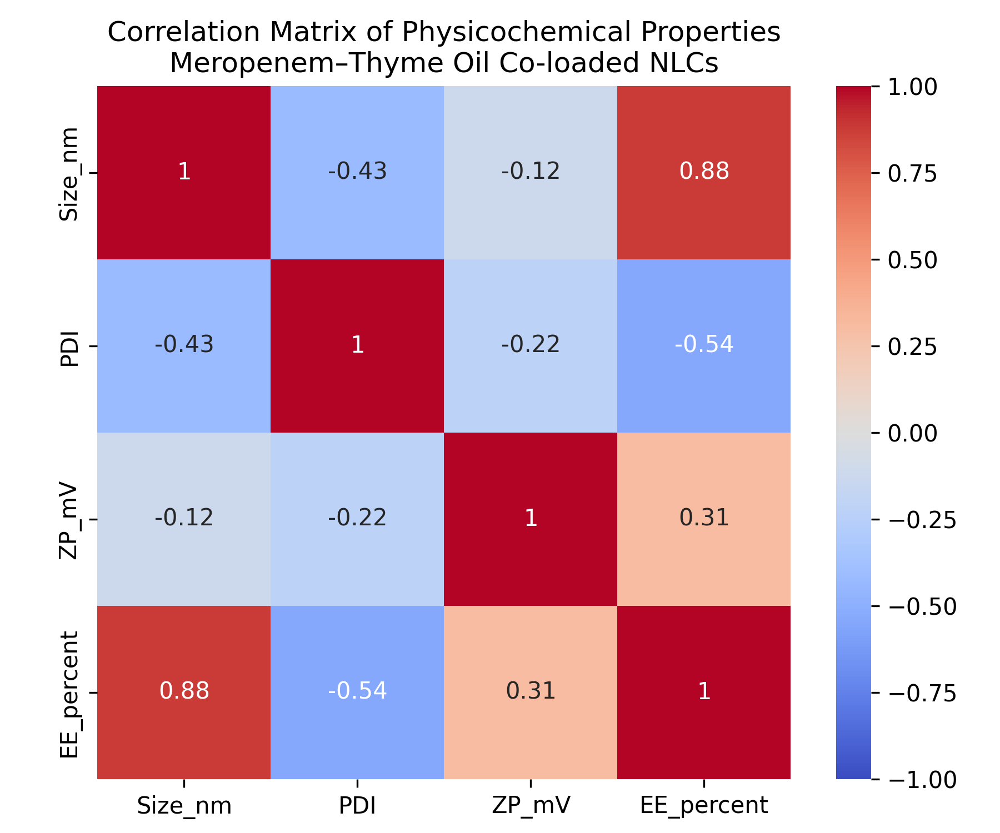
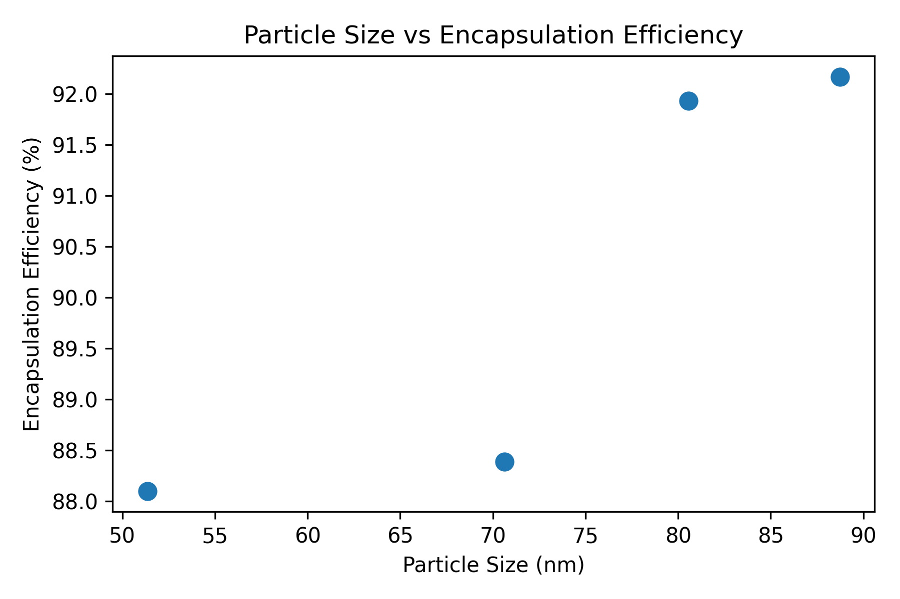
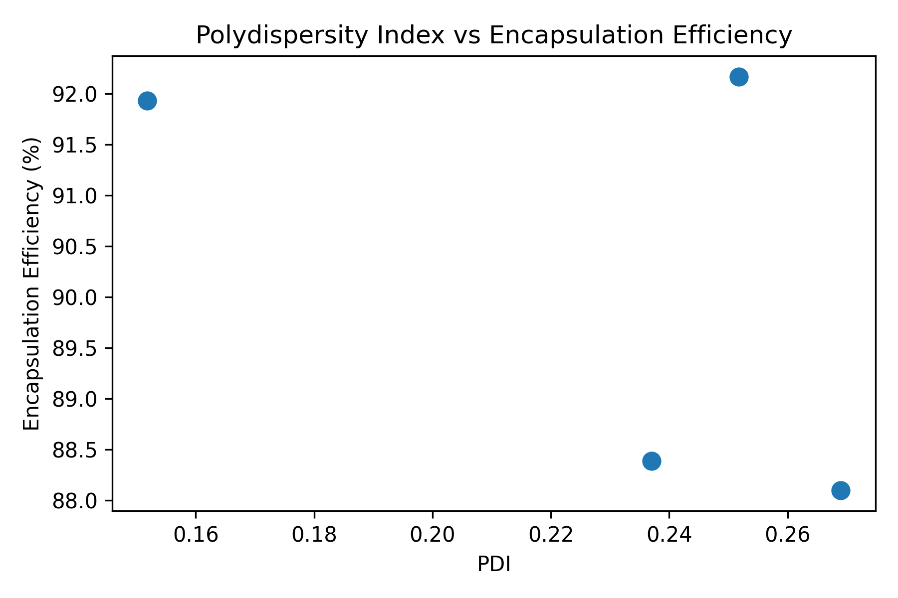
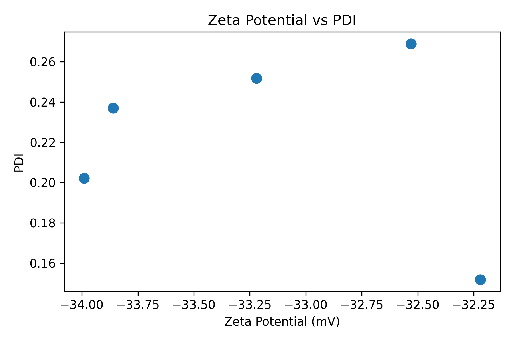

# Nanomedicine Formulation Data Analysis

## Objective
To analyse nanostructured lipid carrier (NLC) formulation data using
data science techniques to understand relationships between
physicochemical properties and formulation performance.

## Dataset
Formulation data including particle size, PDI, zeta potential,
and encapsulation efficiency.

## Methods
- Data cleaning
- Descriptive statistics
- Correlation analysis
- PCA
- Regression analysis
## Results & Visualisations

### Correlation Heatmap

### Particle Size vs Encapsulation Efficiency

### PDI vs Encapsulation Efficiency

### Zeta Potential vs PDI

## Tools
Python, pandas, matplotlib, seaborn, scikit-learn

Dr Ali Ahmad
MBBS, 
MSc (CMM),
MSc (DDD)
